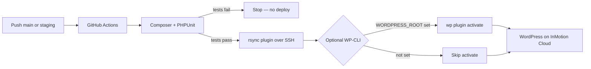

# Use GitHub Actions for CI/CD with WordPress on InMotion Cloud

**Audience:** Customers and internal teams who want a concrete, modern deployment workflow without becoming CI/CD experts overnight.

---

## What CI/CD means (in plain language)

**Continuous Integration (CI)** means: every time your team saves work into a shared repository (for example, GitHub), an automated process checks out that code and runs predictable checks—like automated tests—so problems are caught early.

**Continuous Deployment (CD)** means: when those checks pass, the same automated process can publish the approved changes to a live environment (here, your WordPress site on InMotion Cloud) without someone manually copying files.

Together, CI/CD is simply **“automate testing, then automate release when tests pass.”** That reduces human error, makes updates repeatable, and gives technical buyers confidence that your hosting workflow matches what modern teams expect.

---

## What this example proves on InMotion Cloud

This proof of concept shows that a WordPress site hosted on **InMotion Cloud** can:

- Keep custom site code in a **GitHub** repository  
- Run a **GitHub Actions** pipeline on every push  
- Execute a **PHPUnit** smoke test during the pipeline  
- **Stop the deployment** if the test fails  
- **Deploy automatically to production** when tests pass and the change lands on `main`  
- **Optionally deploy to a staging WordPress install** when you push the `staging` branch (same tests, different GitHub Environment and server paths)  
- **Optionally activate the plugin over SSH** using **WP-CLI** after `rsync`, so you do not have to click **Activate** in wp-admin on every first-time setup (when you configure a path variable—see below)  

The live site displays a small **release note in the footer** (and an admin notice for administrators) so you can confirm the deployment visually.

> **Scope note:** The repository contains a small **custom plugin** (typical for teams that version themes or plugins). WordPress core is managed by the hosting environment; the pipeline deploys **only the plugin directory** to `wp-content/plugins/…` on the server. That pattern is common, easy to reason about, and maps cleanly to support and sales conversations.

---

## How the pipeline works (high level)

1. A developer pushes a commit to the `main` or `staging` branch on GitHub.  
2. GitHub Actions starts the workflow defined in `.github/workflows/deploy.yml`.  
3. **Test job:** GitHub checks out the code, installs PHP dependencies with Composer, and runs PHPUnit. If any test fails, the workflow fails and **nothing is deployed**.  
4. **Deploy job (only on pushes, not on pull requests):** After tests pass, the workflow writes a short **build marker file** (derived from the Git commit) into the plugin, then runs the shared **deploy** logic (see `.github/actions/deploy-inmotion-plugin/action.yml`): **rsync over SSH** to the plugin directory, then **optional WP-CLI** `plugin activate` when you have set `WORDPRESS_ROOT` on that GitHub Environment.  
   - Push to **`main`** → GitHub Environment **`production`**  
   - Push to **`staging`** → GitHub Environment **`staging`**  
5. Visitors see the updated footer text; administrators may also see a dashboard notice.



---

## What you need before you start

- A **WordPress** installation on **InMotion Cloud** where you can install plugins.  
- **SSH access** to the account that owns the WordPress installation (host, username, and either key-based or password-based access—this article assumes **SSH keys**, which work best for automation).  
- A **GitHub** repository for the project.  
- Permission to add **GitHub Actions secrets**, **environment secrets/variables**, and (recommended) GitHub **Environments** named **`production`** and (if you use the staging branch) **`staging`**—so credentials and paths can differ per target without duplicating workflow files.

---

## Repository layout (what each part is for)

| Path | Purpose |
|------|---------|
| `composer.json` | Declares **PHPUnit** (and any future PHP tooling) for CI. |
| `phpunit.xml` | PHPUnit configuration. |
| `tests/` | Automated tests. A failing test **fails the pipeline**, which blocks deploy. |
| `wp-content/plugins/inmotion-ci-cd-poc/` | The plugin that is deployed to production. |
| `.github/workflows/deploy.yml` | Defines **PHPUnit**, **deploy to production** (`main`), and **deploy to staging** (`staging`). |
| `.github/actions/deploy-inmotion-plugin/action.yml` | Shared steps: SSH agent, `rsync`, optional WP-CLI activate. |
| `docs/support-article-ci-cd-wordpress-inmotion-cloud.md` | This article (you can publish it in your help center). |

---

## One-time server setup

### 1. Find your real WordPress paths on InMotion Cloud

Installations commonly use one of these layouts (your exact paths may differ):

| Layout | Typical WordPress root (`WORDPRESS_ROOT` for WP-CLI) | Typical plugin folder (`SSH_REMOTE_PLUGIN_PATH`) |
|--------|------------------------------------------------------|---------------------------------------------------|
| Primary domain / single site | `/home/USERNAME/public_html` | `/home/USERNAME/public_html/wp-content/plugins/inmotion-ci-cd-poc` |
| Addon / parked domain | `/home/USERNAME/domains/EXAMPLE.COM/public_html` | `/home/USERNAME/domains/EXAMPLE.COM/public_html/wp-content/plugins/inmotion-ci-cd-poc` |

Use SSH or your file manager to confirm where **`wp-config.php`** lives—that directory is your **WordPress root**. The plugin path must be under that same tree in `wp-content/plugins/inmotion-ci-cd-poc`.

### 2. Create the plugin directory on the server

Ensure the plugin directory exists on **each** target (production and staging, if you use both):

```bash
mkdir -p /home/USERNAME/public_html/wp-content/plugins/inmotion-ci-cd-poc
```

Replace the path with the absolute path that matches your site.

### 3. Deploy SSH key (recommended pattern)

1. Generate a **dedicated** key pair used only for this deployment (do not reuse personal keys).  
2. Install the **public** key in `~/.ssh/authorized_keys` for the SSH user that owns the WordPress files.  
3. Store the **private** key only in **GitHub Actions secrets** (see below).

Restrict the key with `command=` and `restrict` options if your security policy requires command-limited access; the minimal example here uses a normal shell user for clarity.

---

## GitHub configuration

### Use environment-scoped secrets (recommended)

The workflow attaches deploy jobs to GitHub **Environments** so you can keep **production** and **staging** values separate without changing YAML:

| Environment | When it runs | Typical use |
|-------------|----------------|-------------|
| `production` | Push to **`main`** | Live customer site |
| `staging` | Push to **`staging`** | Staging copy of the site |

In GitHub: **Settings → Environments**. Create **`production`** before the first production deploy. If you use the **`staging`** branch, create **`staging`** too (or remove the `deploy_staging` job and the `staging` branch entries from `deploy.yml` so runs are not blocked waiting for an unused environment).
Under each environment, add the **same secret names** with **values that point at that environment’s server**:

| Secret | Example value | Meaning |
|--------|----------------|---------|
| `SSH_PRIVATE_KEY` | Multiline PEM for the deploy key | Used by `webfactory/ssh-agent` to authenticate (prefer a **different** key per environment if your policy requires it). |
| `SSH_HOST` | `example.com` or an IP | SSH hostname for **that** environment. |
| `SSH_USER` | `exampleuser` | SSH username. |
| `SSH_REMOTE_PLUGIN_PATH` | `/home/exampleuser/public_html/wp-content/plugins/inmotion-ci-cd-poc` | **Absolute** path to the plugin directory on the server (no trailing slash required). |

You can still define these secrets at the **repository** level if you prefer; environment secrets **override** repository secrets when the job uses that environment.

### Optional: WP-CLI activation (environment variables)

If the server has **WP-CLI** available over SSH, set these **Variables** (not secrets) on the same GitHub Environment:

| Variable | Required | Example | Meaning |
|----------|----------|---------|---------|
| `WORDPRESS_ROOT` | No | `/home/exampleuser/public_html` | WordPress root passed to `wp … --path=…`. If unset, deploy still runs, but activation in wp-admin is manual. |
| `WP_CLI_BIN` | No | `wp` or `/usr/local/bin/wp` | Binary to invoke on the remote host (defaults to `wp` if unset or empty). |

**Note:** Avoid spaces in `WORDPRESS_ROOT` for this minimal example, or adjust the SSH command to add quoting for your paths.

---

## WordPress setup

1. After the first successful deploy, either:  
   - rely on **WP-CLI** (if you set `WORDPRESS_ROOT` on the GitHub Environment), or  
   - in **WP Admin → Plugins**, activate **“InMotion CI/CD PoC”** manually once.  
2. Visit the public site: you should see a short line in the footer such as:  
   `CI/CD PoC — release 1.0.0 (build abc1234)`  
3. In the dashboard, an administrator should see an informational notice with the same version and build.

---

## Making a visible change (prove the pipeline updated production)

1. Edit `wp-content/plugins/inmotion-ci-cd-poc/includes/release-meta.php` and bump `inmotion_ci_cd_poc_version()` (for example from `1.0.0` to `1.0.1`).  
2. Optionally update the `Version` header in `inmotion-ci-cd-poc.php` to match.  
3. Commit and push to `main`.  
4. Confirm in GitHub: the **PHPUnit** job is green, then **Deploy to production (main)** (or **Deploy to staging (staging branch)**) is green.  
5. Reload the live site: the footer should show the new version, and the build hash should match the short Git SHA from the successful run.

---

## Pipeline screenshot for your article

For the Jira “success” checklist, capture **one screenshot** of the successful workflow run on GitHub that clearly shows:

- The workflow name **“Test and deploy”**  
- A green **PHPUnit** job  
- A green **Deploy to production (main)** job (include the optional **Activate plugin (WP-CLI, optional)** step inside the composite action if it ran)  

**Where to click:** GitHub → your repository → **Actions** → select the latest run on `main` → use your browser’s screenshot tool.

---

## How failures behave (what to tell customers)

- If PHPUnit fails, the **Test** job fails, the workflow is marked failed, and **neither** deploy job runs (`needs: test`).  
- If SSH/rsync fails (bad path, permissions, host key, or key), the corresponding **Deploy to production** or **Deploy to staging** job fails and that environment keeps the last successful deployment.

---

## Troubleshooting (short list)

| Symptom | Likely cause |
|---------|----------------|
| `Permission denied (publickey)` | Wrong `SSH_PRIVATE_KEY`, wrong user, or public key not in `authorized_keys`. |
| `mkdir: cannot create directory` / rsync errors | `SSH_REMOTE_PLUGIN_PATH` points to the wrong place or user cannot write there. |
| Site shows old text | Browser cache, opcode cache, or deploy path not the same document root WordPress uses. |
| Plugin not in admin list | Files landed outside the active installation’s `wp-content/plugins/`. |
| `wp: command not found` on activate step | Set `WP_CLI_BIN` to the full path of WP-CLI on the server, or install WP-CLI for that user. |
| WP-CLI errors about `--path` | `WORDPRESS_ROOT` does not point at the install that contains `wp-config.php`. |

---

## Security and operational notes (for internal readers)

- Prefer a **least-privilege** deploy user and directory-scoped access where possible.  
- Rotate deploy keys if anyone who had access leaves the team.  
- Consider branch protection on `main`, required reviews, and GitHub Environment protection rules before enabling automatic production deploy for larger teams.

---

## Summary

InMotion Cloud works with the same building blocks customers already know from other platforms: **GitHub**, **GitHub Actions**, **SSH**, and **rsync**. This example wires them together for a **WordPress plugin** with **PHPUnit in CI**, **automatic deployment** from **`main`** (production) and optionally **`staging`**, plus **optional WP-CLI activation**—giving sales and support a tangible story and a repeatable recipe.
